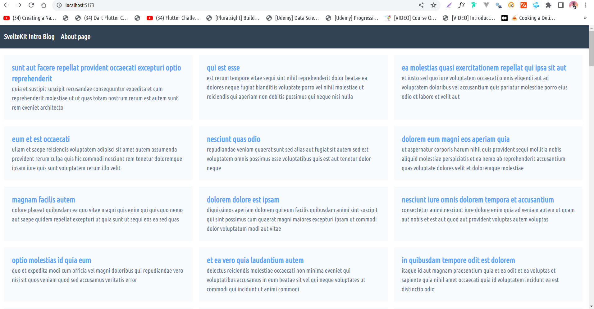

# SvelteKit Intro Blog



> Simple SvelteKit Blog with data from JSON Placeholder API and Tailwindcss

## Developing

Once you've created a project and installed dependencies with `npm install` (or `pnpm install` or `yarn`), start a development server:

```bash
pnpm run dev

# or start the server and open the app in a new browser tab
pnpm dev
```

## Building

To create a production version of your app:

```bash
pnpm build
```

You can preview the production build with `pnpm preview`.

> To deploy your app, you may need to install an [adapter](https://kit.svelte.dev/docs/adapters) for your target environment.
